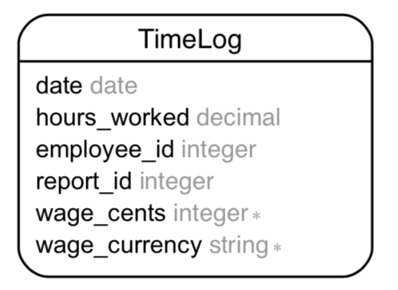

# PayReporter

This app is a solution to Wave's [se-challenge-payroll](https://github.com/wvchallenges/se-challenge-payroll) challenge. This application goes beyond the challenge outlined in the assignment and goes beyond the initial requirement.

Please note, while this application remains easy to review, some of the design decisions were
optimized to demonstrate my skills and would not reflect decisions I'd usually take while building
an MVP.

Key features:

+ 95.63%+ test coverage
+ Mobile ready
+ Automatic model annotations
+ Automatic Entity Relationship Diagram generation (`erd.pdf`)
+ Tableless models
+ Service objects
+ Payroll Report available as:
  + Human friendly view
  + Printer friendly view
  + JSON API
  + CSV download
+ Haml views
+ Custom Rubocop config
+ Beautiful code, if I say so myself
+ [`money`](https://github.com/Rubymoney/money) gem to handle monetary values
+ Impossible to upload anything except CSV

## Design Decisions

+ Since I wanted to save the least amount of information possible in the database, I stored the
  individual Time Logs in the database.
+ Instead of saving the `job_group` as originally given, I saved their corresponding wage rates of
  $20 and $30, for A and B, respectively instead — this helps make the database more user neutral
  and allows us to add more job groups in the future by modifying only one line of code. It also
  means we can do the majority of our math in SQL
+ I could have either used only service objects or only tableless models. Instead, to demonstrate
  my ability in each, I used both service objects and created a tableless model.
+ I used Semantic UI because I'm very comfortable with it, it's beautiful, and gives me almost
  everything I could possibly need when making a prototype.
+ In addition to the required format, I provided a "human friendly" version of the Payroll Report
  because that's how I'd have structured it in my own applications — it's a much better way to
  interact with the data. It also allowed me to demonstrate my use of partials
+ I also allowed the Payroll Report to be downloaded as CSV, and served it over JSON to demonstrate
  my abilities.

There's **one caveat** of the single table decision, but it's fine given the use-case. It is technically
possible for the same report_id to be uploaded twice. Since the validation on whether
a Time Report's report_id already exists in the database happens at the application layer: if a user
opens two sessions and uploads a Time Report from two pages at _exactly_ the same time, and both
`TimeReport` validations run before either has been saved to the database, then both validations
will succeed and save the time_report.

However, given that app this is for a single client, and this case is incredibly hard to trigger
unless you're being hit by hundreds or thousands of requests a second, the risk was worth taking
to demonstrate a tableless model.

## Application

Let's walk over key parts of the application. The `schema.rb` only defines one important table, since a "Time Report" is probably a collection of Time Logs, that's what the table is:

### Models

* `app/models/time_log.rb`: The `money_rails` gem combines the `wage_cents` and `wage_currency` fields into a `wage` attribute that produces a [`money`](https://github.com/Rubymoney/money) instance.
* `app/models/time_report.rb`: A tableless model that processes the non-standard Time Report CSV files and saves them as `TimeLog`s.

### Controllers

* `time_reports_controller.rb`: This saves `TimeReport`s and redirect back to the `root_path`, along with some `flash` messages.
* `payroll_report_controller.rb`: Depending on the `format`, or `params[:printer]` value, it renders:
  + a human friendly Payroll Report
  + a printer friendly Payroll Report
  + a CSV printer report for download
  + a JSON version of the Payroll Report

### Services

Every service object in `app/services/` does one specific thing only, and is named boringly after its role. To learn more, please read my article [_Rails Service Objects: A Comprehensive Guide_](https://www.toptal.com/ruby-on-rails/rails-service-objects-tutorial) on the Toptal blog.

  * `application_service.rb`: Contains shared decorative methods
  * `payroll_manager/reporter.rb`: Runs a SQL query to obtain the data required to build a Payroll Report
  + `payroll_manager/report_json_formatter.rb`: Formats a Payroll Reports from the `PayrollManager::Reporter` to JSON
  + `payroll_manager/report_csv_formatter.rb`: Formats a Payroll Reports from the `PayrollManager::Reporter` to CSV

### Views

I prefer HAML because I don't like typing.

* `app/views/layouts/application.html.haml`: the layout only renders the body and, two partials:
  * `_header.html.haml`: is rendered before pages, contains the header that runs across the top of the page, and loads stylesheets with subresource integrity
  * `_footer.html.haml`: is rendered after pages, loads external javascript with subresource integrity, and contains some custom JavaScript.
* `app/views/payroll_report/index.html.haml`: Renders the index page, and depending on the of `@printer` passed onto it by the controller renders one of two partials:
  * `_human_friendly_report.html.haml`: A human-friendly version of the Payroll Report
  * `_printer_friendly_report.html.haml`: A printer friendly version of the Payroll Report

Also, misc:
  * the `ApplicationHelper` contains a method to help translate flash messages to Semantic UI
  classes

## Building, testing and deploying

Everything about getting the app up and running

### Testing

* For linting errors run `bundle exec rubocop`
* For tests and coverage report run `bundle exec rails test`

### Development

1. Use rvm
1. Install the appropriate Ruby as declared in the Gemfile
1. Run `bundle exec rails s`
1. visit `http://localhost:3000`

### Production

1. Sign up for Heroku
1. Install the Heroku CLI
1. Clone this repo and run `heroku create`
1. Set the appropriate buildpack using `heroku buildpacks:set https://github.com/bundler/heroku-buildpack-bundler2`
1. Push using `git push heroku master`
1. Migrate using `heroku run bundle exec rails db:migrate`
1. `heroku open` to interact with the website

### CI/CD

While I usually wouldn't mind documenting a fantastic CI/CD solution here, I've already done it in
[_How to Build an Effective Initial Deployment Pipeline_](https://www.toptal.com/devops/effective-ci-cd-deployment-pipeline) and so, documenting it here again would be redundant. I've added a template (`.gitlab-ci.yml.template`) that requires you to tweak `$INSERAPPNAME`. Follow the instructions in the article
to end up with a _free_ CI/CD flow that looks like this:

## Things I didn't do

1. I did not create a React front-end for this app, even though I can, because it simply wasn't
  required. I'm familiar enough with the tech to use it when possible, I've given a sponsored
  [React Workshop in Lahore, Pakistan](https://www.toptal.com/community/events/2018-03-18/react-workshop-lahore), I've used it in [a live app built during a hackathon](https://care.gilani.me), and made minor
  use of it in production apps when the need justified it.
1. I did not use Rspec for testing even though I usually exclusively use it. The time required
  to setup Rspec didn't justify the use, and I ended up using Minitest for the same
  effect.

## Evaluation

Evaluation of your submission will be based on the following criteria.

> 1. Did you follow the instructions for submission?

Yes, or I will when I submit this.

> 2. Did you document your build/deploy instructions and your explanation of what you did well?

Yes

> 3. Were models/entities and other components easily identifiable to the reviewer?

Yes. I've documented everything, so they should be.

> 4. What design decisions did you make when designing your models/entities? Are they explained?

I used a tableless model and service objects, as well as raw SQL queries instead of ActiveRecord/Arel queries or even mapping through the data in memory. The justification for these is available above.

> 5. Did you separate any concerns in your application? Why or why not?

No, this app wasn't complicated enough to require shared logic. In fact, no controllers or models share any logic

> 6. Does your solution use appropriate data types for the problem as described?

Data-types were not described. I inferred them, and this question made me feel like you _wanted_ me to use an integer for Report IDs. In real life, however, I would've used a string because they're meta properties the user supplied, and one user's Report IDs data-type don't necessarily have to match another's
